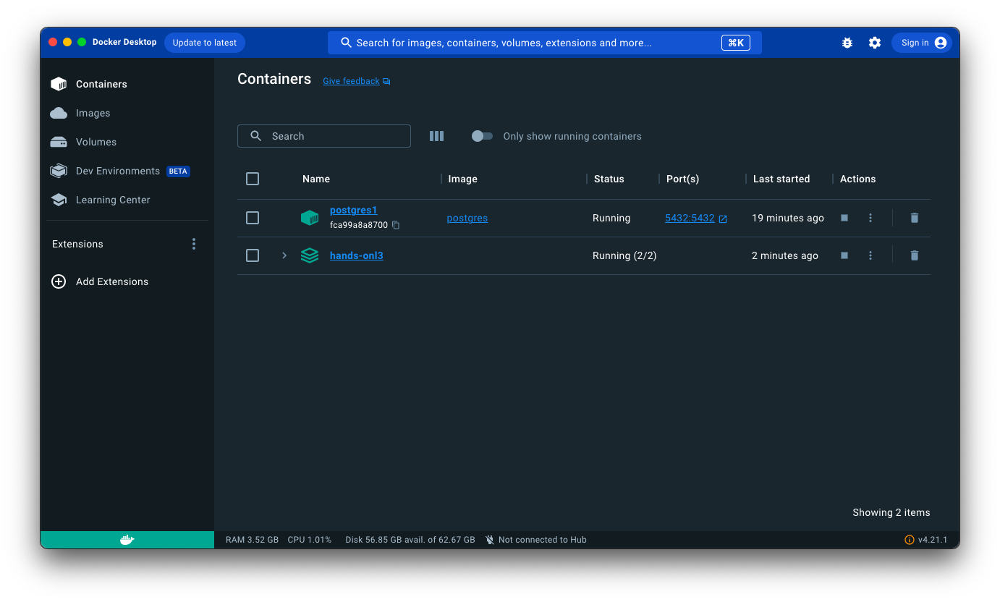
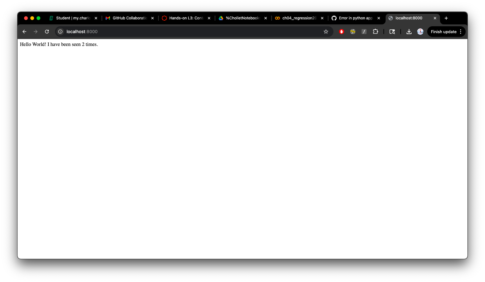

# Hands-on L3: Containerization

In this assignment we started by downloading docker and using it to pull postgres.
Then we copied and pasted files in order to build a webpage app: app.py, Dockerfile, requirements.txt, compose.yaml.
Though, the app.py file has syntax errors when importing flask and redis. It also has tabbing problems.
Once fixed, we have a webapp that counts the amount of times that we open/refresh the page.

